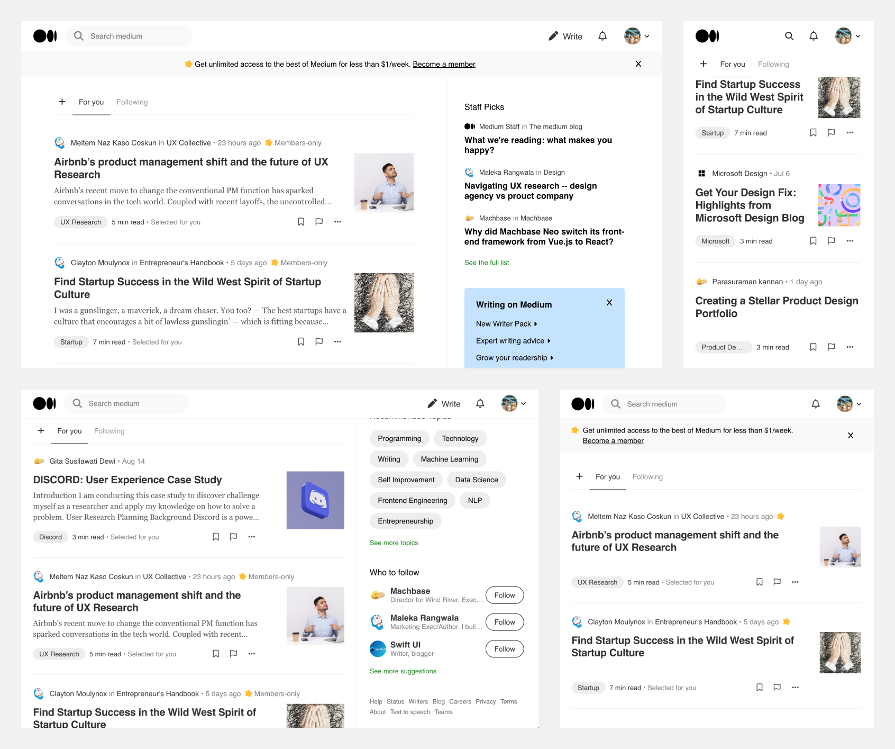

# Medium Cloning Practice

## 안녕하세요!
본 리포지토리에는 [Medium](https://medium.com/) 페이지 디자인을 클론해보는 프로젝트를 진행한 내용이 포함되어 있습니다.

## 사용 기술
HTML, CSS, Vanilla JS

## 주요 구현 내용

- flex-box를 활용한 header, main, sidebar, list-item 구현
- fontawesome의 폰트 아이콘을 활용하여 iconset 적용
- media query를 활용하여 각 break-point마다 다른 레이아웃이 적용되도록 구현 
- 페이지 스크롤 시, sidebar의 내용이 마지막에 도달했을 때 페이지 하단에 sticky 될 수 있도록 구현

## 마치며
기본적인 Markup과 CSS의 활용법을 다시 익히면서, JavaScript를 활용한 Layout 조작에 대한 연습을 해볼 수 있었던 프로젝트였습니다.